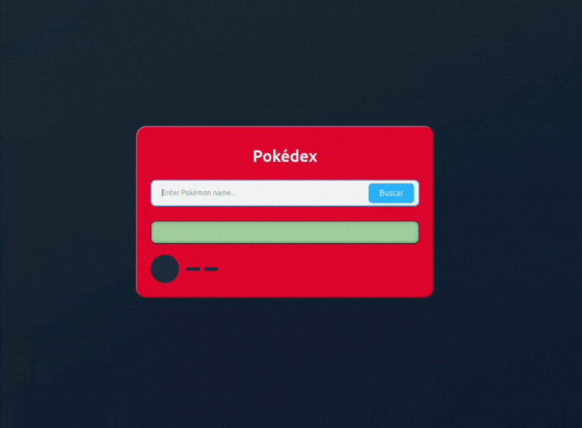

# ZRP pokedex

### Welcome to the ZRP pokedex! This project is built using Node.js and can be started using npm or Docker Compose.
<div align="center">
   
</div>

 

## Table of Contents

- [ZRP pokedex](#zrp-pokedex)
    - [Welcome to the ZRP pokedex! This project is built using Node.js and can be started using npm or Docker Compose.](#welcome-to-the-zrp-pokedex-this-project-is-built-using-nodejs-and-can-be-started-using-npm-or-docker-compose)
  - [Table of Contents](#table-of-contents)
  - [Getting Started](#getting-started)
    - [Prerequisites](#prerequisites)
    - [Installation](#installation)
  - [Using Docker Compose](#using-docker-compose)
  - [Manual with NPM](#manual-with-npm)
- [Accessing the Application](#accessing-the-application)

## Getting Started

### Prerequisites

Make sure you have the following installed on your machine:

- [Node.js](https://nodejs.org/) (version 22.x or higher)
- [npm](https://www.npmjs.com/) (comes with Node.js)
- [Docker](https://www.docker.com/)
- [Docker Compose](https://docs.docker.com/compose/)

### Installation

## Using Docker Compose
This command will build and run frontend an backend

   ```sh
    docker-compose up --build -d
   ```
This will set up and run both the frontend and backend without needing to install dependencies manually.

## Manual with NPM

1. Clone the repository:

   ```sh
   git clone https://github.com/PedroDalpa/zrp-pokedex
   cd zrp-pokedex
   ```

2. Install the backend dependencies:

   ```sh
   cd backend/
   npm install
   ```

3. Running the backend Project:

    ```sh
    npm run start:dev
    ```

4. Install the frontend dependencies:
   1. open another terminal
   2. go to the root folder of the project

   ```sh
   cd frontend/
   npm install
   ```

5. Running the frontend Project:

    ```sh
    npm run start:dev
    ```


# Accessing the Application

- **Backend**: The backend application will be available at [http://localhost:3000](http://localhost:3000).
- **Frontend**: The frontend application will be available at [http://localhost:5173](http://localhost:5173).
